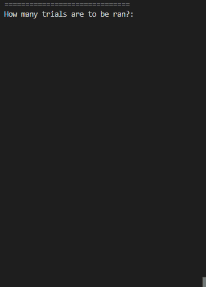

# Coin-Flip-Simulation
A very simple coin flip simulation that uses a random number generator to determine a coin flip. This simulation is designed to demonstrate the probability of flipping a coin and getting either heads or tails.

